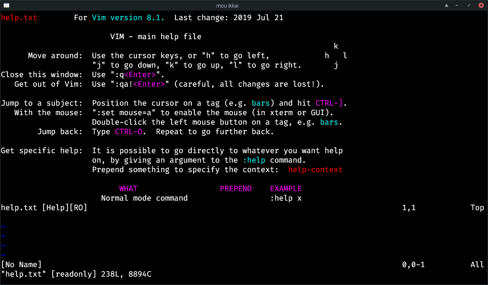
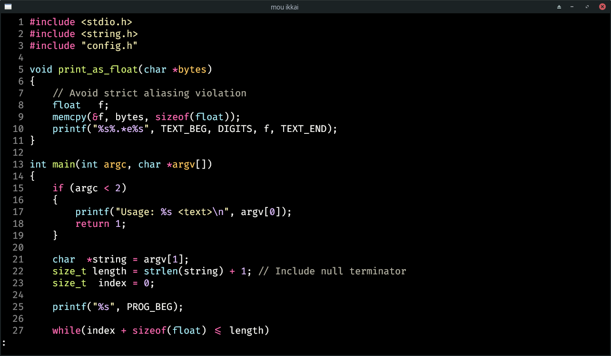

# Termiku

Termiku is a lightweight, easily customizable, GPU-accelerated terminal emulator made in Rust.

While usable ([Vim works](#screenshots)), it is still work in progress.\
Features are carefully chosen to create a fast, straighforward terminal for the 21st century,
though some [fun](#joke-features) can definitely be had with it.

### Features

- Font ligature support
- RGB "direct color" support
- Transparency support
- Simple customization via TOML

### Planned Features

These features are planned, but it is not clear when and if they will be added.

- Background image setting
- SIXEL graphics
- Multiple terminal tabs

### Joke Features

- YouTube playback: run `termiku --youtube VIDEO_ID`

### Screenshots

---

